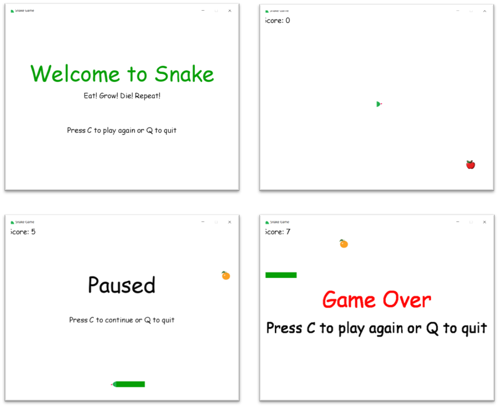

# Snake-Pygame
A simple snake game created using pygame and python

### Index
- [Screenshots](#screenshot)
- [Game Features](#feature)
- [Game Controls](#controls)
- [Setup](#setup)
- [License](#license)

### <a name="screenshot"></a>Screenshots



### <a name="feature"></a>Game Features
It has following features
1. Scoring
2. Pause
3. Growing Snake 
4. Random food generation
5. Wall hitting logic
6. Self hitting logic

Features to come:
- Sound and music
- Mouse control and clickable button
- Installer for the game
- Android app of the game

### <a name="controls"></a>Game Controls

|              | Button              |
|--------------|---------------------|
| Move Left    | <kbd>left</kbd>     |
| Move Right   | <kbd>right</kbd>    |
| Move Up      | <kbd>up</kbd>       |
| Move Down    | <kbd>down</kbd>     |
| Pause game   | <kbd>p</kbd>        |
| UnPause game | <kbd>c</kbd>        |
| Quit game    | <kbd>q</kbd>        |
| Start game   | <kbd>c</kbd>        |

### <a name="setup"></a>Setup 

````
pip install -r requirements.txt
````

### <a name="license"></a>License
[MIT](LICENSE) license